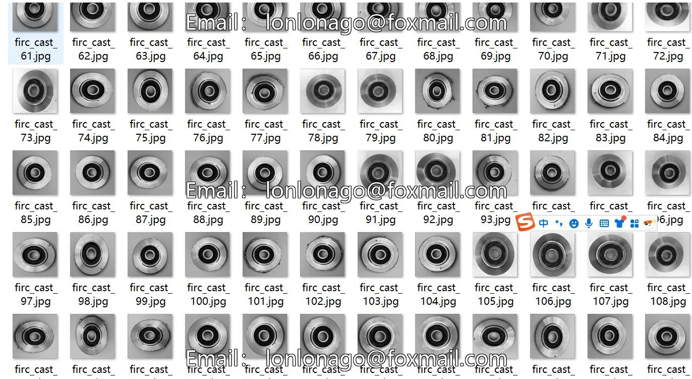
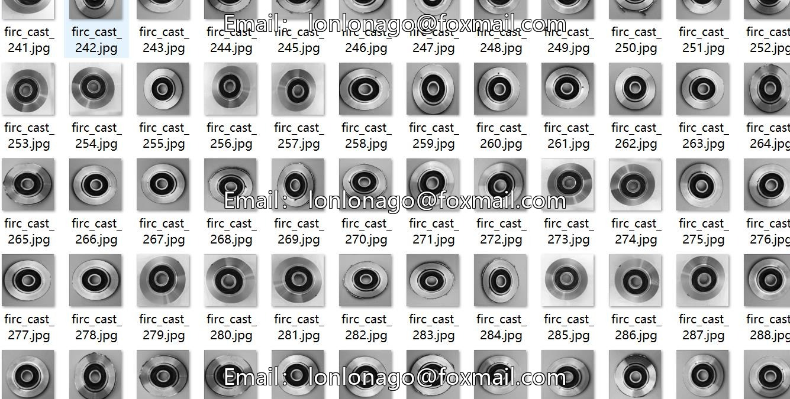
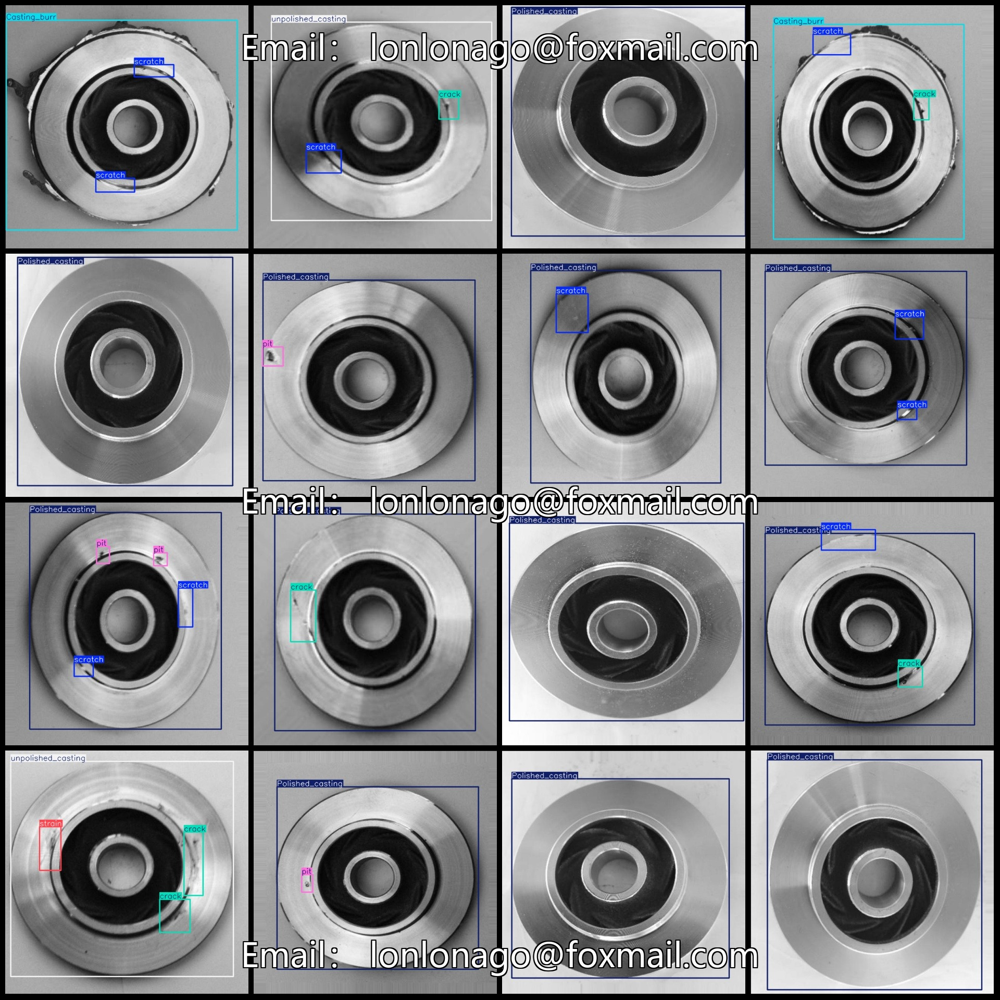
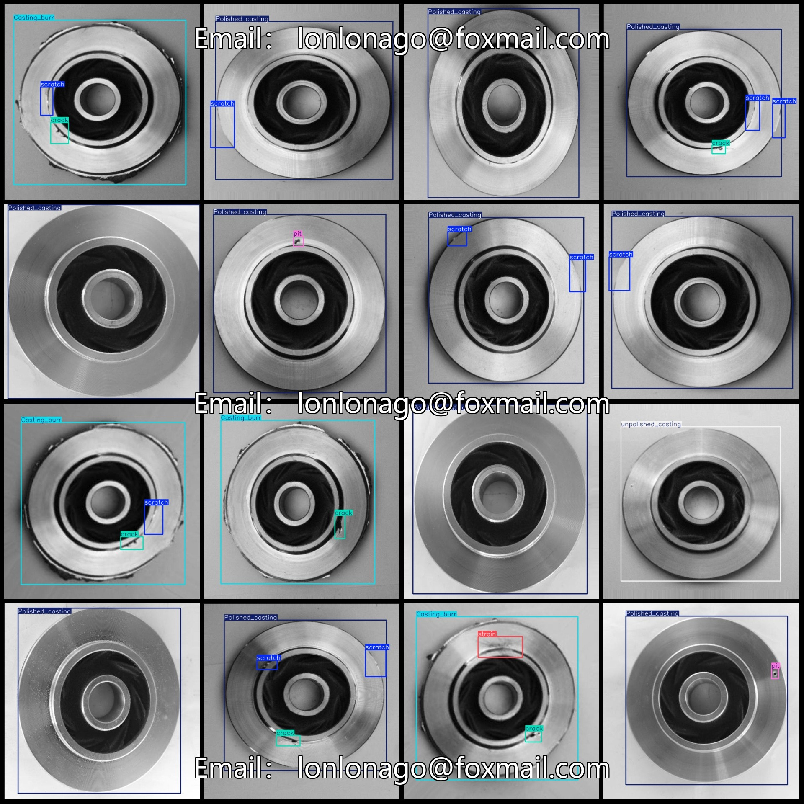

# Bearing Surface Defect Detection Dataset in VOC+YOLO format, 2064 images in 8 categories

Dataset format: Pascal VOC format + YOLO format (txt file without split path, only containing jpg images and corresponding VOC format xml files and yolo format txt files)
Number of images (jpg file count): 2064
Number of annotations (xml file count): 2064
Number of annotations (txt file count): 2064
Number of annotation categories: 8
Annotation category names (note that the order of yolo format categories does not correspond to this, but is based on the labels folder classes.txt): ["Casting_burr", "Polished_casting", "burr", 
"crack", "pit", "scratch", "strain", "unpolished_casting"]
Number of bounding boxes for each category:
"Casting_burr" (casting burr) = 377
"Polished_casting" (polished casting) = 1564
"burr" (burr) = 2
"crack" (crack) = 804
"pit" (pit) = 529
"scratch" (scratch) = 1444
"strain" (strain) = 47
"unpolished_casting" (unpolished casting) = 137
Application scenario: Common defect categories in metal casting or machine processing parts surface quality inspection.
Total number of bounding boxes: 4904
Image resolution: 640x640
Dataset exists with enhancements: Some enhanced image files are present
Annotation tool used: labelImg
Annotation rules: Drawing bounding boxes for categories
Important note: No guarantees are made about the accuracy of the trained models or weight files
Preview of images:
Annotation example:
Image

Here is a pay link on Stripe ( https://buy.stripe.com/3cs8yP7sY87d0vu9AB ). Please contact me lonlonago@foxmail.com after funding $89, and I will send you a complete data files , thank you!

